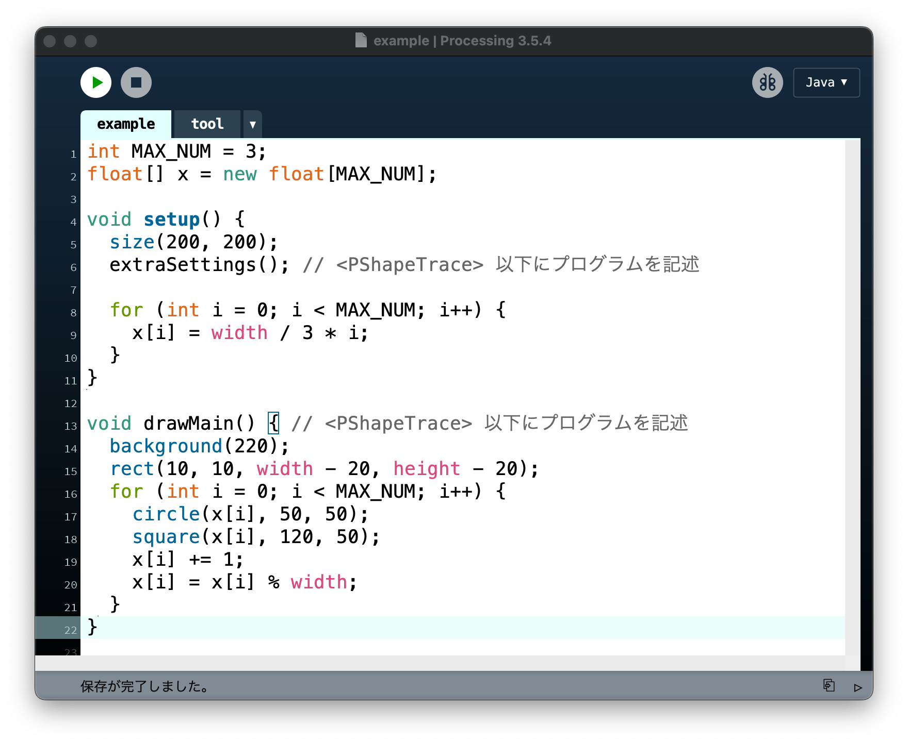
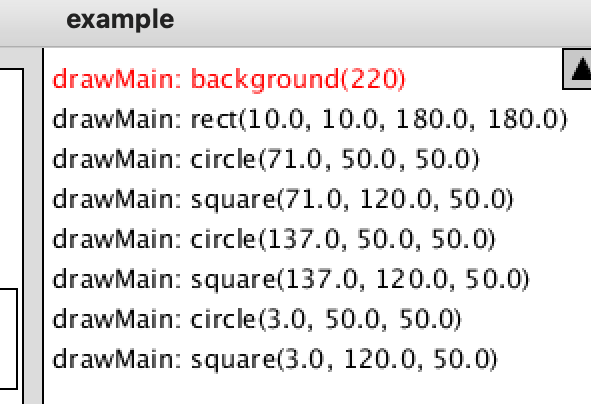
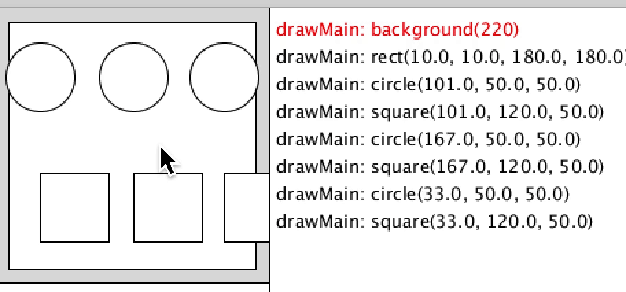
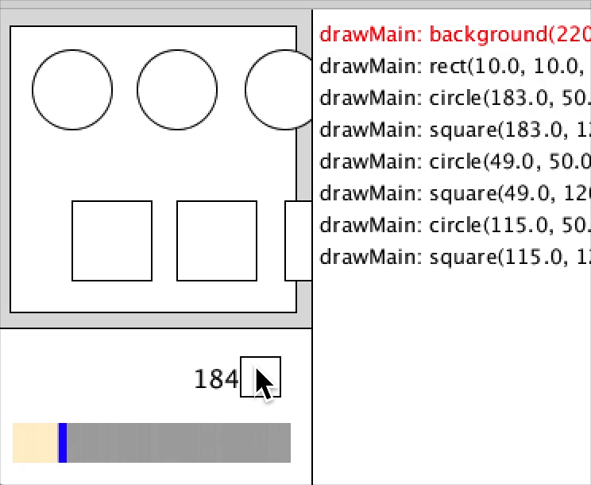
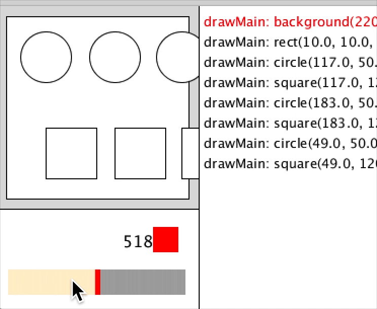

# PShapeTrace

PShapeTrace は Processing のプログラムが実行する描画命令を記録し、
実行された命令と、画面に表示されている図形の対応関係を可視化するライブラリです。

PDE（Processing Development Environment）で導入することで、
実行したプログラム内の図形がどのような関数・引数によって描画されたのかを表示することができます。
また、実行を一時停止させたり、過去のフレームに巻き戻して表示させたりすることも可能です。


## 使用方法

PShapeTrace は、分析対象のプログラムに直接組み込んで使うプログラムファイルとして作られているツールです。
本ツールの機能は以下の3つです。

- 呼び出した描画命令の一覧表示
- 実行画面の図形に対応する描画命令の特定
- 描画の一時停止

以下の使用方法の説明では、[exampleディレクトリ](example)にあるプログラムを使っています。
このディレクトリに格納されたすべての pde ファイルをダウンロードし、
Processing IDE でファイルを開いて実行すると、ツールが有効な状態で起動します。

このプログラム `example.pde` ファイルの内容は次のようになっています。
 - `setup` の中では、ウィンドウのサイズを設定する `size()` の呼び出しを行ったあと、PShapeTrace の設定を行う `extraSettings` を呼び出しています。プログラム用の設定を、その下に記述しています。
 - `drawMain` は、通常のプログラムで `draw` に記述する内容を記述しています。



プログラムを実行すると、Processing プログラムとしての動作を行う部分が左上に表示され、
右側と下側に、本ツールが提供するユーザインタフェースが表示されます。


### 呼び出した描画命令の一覧表示

実行画面の右側に、画面内にある図形を描画するために使われた命令の一覧が表示されます。

1行が1つの命令に対応しており、実行順序のとおり、上から並んでいます。
各行の形式は次の通りです。

> [描画関数を呼び出した関数名]:[描画関数名]\([実際の引数の値])

引数に変数や計算式を使用していた場合でも、その中身の数値が表示されます。
以下に示す図では、`drawMain` 関数が `background(220);` を最初に呼び出し、
次に `rect(10, 10, 180, 180);` を呼び出し、
さらに `circle`、`square` を呼び出していったことが示されています。



### 実行画面の図形に対応する描画命令の特定

実行画面の図形をクリックすると、描画情報一覧の内、該当する図形を赤字でハイライトすることができます。
これにより、特定の図形が、どの命令によって描画されたのかを確認できます。



### 描画の一時停止

実行画面下部の右側に表示されている正方形が、描画処理の一時停止・一時停止の解除を行うボタンです。
クリックすると描画処理が一時停止し、もう1回クリックすると一時停止状態が解除されます。



実行画面下部の長方形が、描画のタイムラインを表します。
一時停止中に長方形内部をクリックするか、カーソルキーの左右を押すと、
過去のフレームの状態を画面に表示させることが可能です。
呼び出した描画命令の一覧も、そのフレームを描画した命令一覧に切り替わります。



一時停止中も、図形をクリックすると、その図形を描画した命令がハイライト表示されます。


### 既存のプログラムに導入する方法

既存の Processing プログラムに本ツールを導入する場合は、以下の操作を行ってください。

1. [toolファイル](example/tool.pde)をダウンロードします。
2. ツールを導入したいプログラムのディレクトリ内に tool ファイルを設置します。
3. 設置した状態で Processing の開発環境（PDE）を開き、tool のタブが増えていることを確認します。確認できなかった場合は、プログラムを閉じ、開き直してください。
4. プログラムを2箇所書き換えます。
   1. `setup` 関数内で、`size` 関数を呼び出した直後に `extraSettings();`という記述を追加します。
   2. `draw` 関数の名前を `drawMain` に変更します。
5. プログラムを実行します。上記の設定が正しく行われていれば、ツールの GUI がウィンドウに表示されます。


### ツールの使用を終了する方法

ツールの使用を終了する場合は、上記の操作を取り消すための以下の操作を行います。

 - `setup` 関数の中の `extraSettings();` という行を取り除く。
 - `drawMain` 関数の名前を `draw` 関数に変更する。
 - `tool.pde` ファイルを削除する。


### ツールを有効にした状態の最小限のプログラム

本ツールが使える状態の最小限のプログラムは以下の通りです。

 - `setup` 関数を定義し、ウィンドウのサイズ設定を行った後に `extraSettings();` を呼び出す記述を行う。
 - `drawMain` 関数を定義し、ウィンドウに描きたいプログラムを書く。
 - [toolファイル](example/tool.pde) を、プログラムと同一のディレクトリに配置する。

以下に記述例を示します。

```java
void setup() {
  size(400, 300);
  extraSettings();
  
}

void drawMain() {
  background(0);
    
}
```


## 使用上の注意

分析対象とするプログラムに書かれた命令は、PShapeTrace の機能と競合してしまうと、うまく動作しません。
そのため、プログラムの書き方にはいくつかの制限があります。

- ウィンドウのサイズを定義する関数`size`を必ず使用してください。`fullScreen`および 3D には非対応です。
- ウィンドウのサイズがプログラムの実行中に変化することは想定していないため、サイズが変化するようなプログラムでは正しく動作しません。
- `setup`内に記述を追加したい場合は、`extraSettings`の呼び出しより後に記述してください。
  また、`size`より前に記述を追加しないでください。
- フレーム内の図形描画情報のリセットを`background`により検知しているので、`drawMain`(`draw`)内で`background`を使用するようにしてください。
- `tool.pde` ファイルの中には、`draw` 以外にも複数の関数が定義されています。それらが分析対象のプログラムの関数定義と衝突し、コンパイルエラーを起こす可能性があります。このときは、プログラム側の関数の名前を変えてください。
- 画面の状態を巻き戻す機能は、内部的に各フレームでの状態を画像で保存しています。そのため、大画面のプログラムを分析する場合は、保存するフレームの数を自動で減らしますが、それでもメモリ不足になる可能性があります。大学の授業向けに使われるノートパソコンであれば、400×300 程度の大きさでの利用を推奨します。
- Processing は複数のファイルを1つのプログラムとしてまとめて構文チェックなどを行います。そのため、分析対象プログラムに文法誤りがある場合でも、`tool.pde` ファイルに誤りがあるように表示されることがあります。通常は、分析対象プログラム側にエラーがあると考えて調査を行ってください。


## Publication

本ツールについては、下記論文で発表されています。

```
@article{yamasaki_2024,
	title = {Processingプログラミング初学者のための 図形描画命令の実行と描画結果の対応関係の可視化},
	volume = {2024},
	url = {https://ipsj.ixsq.nii.ac.jp/ej/index.php?active_action=repository_view_main_item_detail&page_id=13&block_id=8&item_id=239264&item_no=1},
	abstract = {情報学広場 情報処理学会電子図書館},
	language = {ja},
	urldate = {2024-09-18},
	journal = {ソフトウェアエンジニアリングシンポジウム2024論文集},
	author = {山崎, 雄太 and 石尾, 隆},
	month = sep,
	year = {2024},
	pages = {232--239},
    note = {本論文は「一般論文」カテゴリで発表されました。The paper is unreviewed by the program committee of the event.}
}
```


## License

本プロジェクトは MIT ライセンスのもとで公開されています。
詳しい条件は [LICENSE](https://github.com/yourusername/PShapeTrace/blob/main/LICENSE) をご覧ください。

This project is licensed under the MIT License. See the [LICENSE](https://github.com/yourusername/PShapeTrace/blob/main/LICENSE) file for details.

## Acknowledgements

本プロジェクトは科研費 No.JP20H05706 の補助を受けて実施された研究の成果物です。
