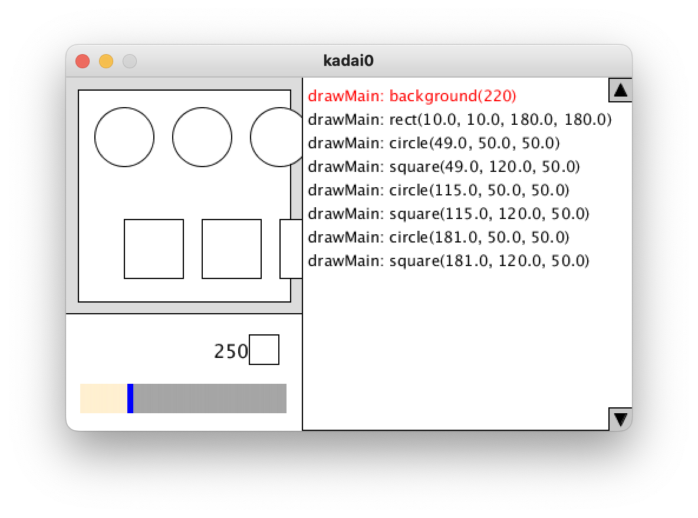

# PShapeTrace

Language: [日本語](README.ja.md) | English

PShapeTrace is a library for Processing that records drawing function calls executed in a program and visualizes the correspondence between executed functions and rendered shapes.
The tool also allows users to pause execution and replay previous frames for analysis.  


## Usage  

PShapeTrace is a source file that is directly embedded into a target program for analysis.  
The tool provides the following three main features:  

- Listing executed drawing function calls  
- Highlighting a function call corresponding to a on-screen shape
- Pause button to suspend the program's drawing process
- Replaying previous frames using recorded images 

The instructions below use the sample program in the [`example` directory](example).  
To try it out, download all `.pde` files in this directory, open them in Processing IDE, and run the program.  
The tool is activated in the program.  

The `example.pde` program contains the following methods:  
- The `setup()` method calls `size()` to set the window size, and then initializes the tool by calling `extraSettings()`. Additional settings for the program follow this call.  
- The `drawMain()` method implements the contents of `draw()` function in regular Processing programs.  

  

When the program runs, the Processing program output appears in the upper left,  
while the tool’s user interface is displayed on the right and bottom sections of the window.  

  


### List of Drawing Function Calls  

On the right side of the interface, a list of drawing function calls that rendered the current screen is displayed.  
Each row corresponds to one function call, arranged in execution order from top to bottom.

The format of each entry is as follows:  

> [Function that called the drawing command]:[Drawing command](Actual parameter values)

Even if variables or expressions were used as parameters, their evaluated numerical values are displayed.
For example, the following figure shows that the `drawMain()` function executed:  

1. `background(220);`  
2. `rect(10, 10, 180, 180);`  
3. `circle(...)`, `square(...)`, and so on.  

  


### Highlighting Function Calls for On-Screen Shapes  

Clicking a shape in the execution screen highlights its corresponding drawing function call in red within the list.  
This makes it easy to identify which command was used to render a specific shape.  

  


### Pausing Execution  

- The square button at the bottom right of the interface pauses and resumes the drawing process.  
- Clicking it pauses execution, and clicking it again resumes execution.  

  


### Replaying past frames

- The rectangular bar at the bottom represents the timeline.  
- While paused, clicking inside this bar or using the left/right arrow keys allows users to replay previous frames.  
- The drawing command list also updates to reflect the selected frame.  

  

Even while paused, clicking a shape highlights the drawing function call used to render it.  


## Integrating the Tool into an Existing Program  

To integrate PShapeTrace into an existing Processing program, follow these steps:  

1. Download the [`tool.pde` file](example/tool.pde).  
2. Place the file in the same directory as your Processing program.  
3. Open the program in PDE and ensure a new tab for `tool` appears.  
   - If it does not appear, try closing and reopening the program.  
4. Modify your code in two places:
   1. In `setup()`, immediately after calling `size()`, add the following line:  
      ```java
      extraSettings();
      ```  
   2. Rename the `draw()` function to `drawMain()`.  
5. Run the program. If setup is correct, the tool’s UI will appear in the window.  


### How to Temporarily Disable the Tool

To temporarily disable the tool, add the assignment statement `TOOL_DISABLED = true;` at the beginning of the `setup()` function.  
The tool checks the value of the `TOOL_DISABLED` variable and skips processes such as `size()` and `extraSettings()` accordingly.  
If added to the example program `example.pde`, it would look like this:

```java
void setup() {
  TOOL_DISABLED = true;
  size(200, 200);
  extraSettings();
  // ...
}
```

To re-enable the tool, simply remove or comment out this assignment statement.  
Note that switching the tool on and off during program execution is not supported.


### How to Stop Using the Tool

To completely stop using the tool, follow the steps below to undo the setup:

- Remove the line `extraSettings();` from the `setup` function.
- If `TOOL_DISABLED = true;` is written in `setup`, remove that as well.
- Rename the function `drawMain` back to `draw`.
- Delete the `tool.pde` file.


### Minimal Program with the Tool Enabled

A minimal program that enables the tool must follow these conditions:

- Define the `setup` function, set the window size, and call `extraSettings();` afterward.
- Define the `drawMain` function and write the drawing logic for the window.
- Place the [tool file](example/tool.pde) in the same directory as the program.

Example:

```java
void setup() {
  size(400, 300);
  extraSettings();
}

void drawMain() {
  background(0);
}
```


## Supported Drawing Functions

Due to implementation constraints, only a subset of drawing functions are supported for recording:

- `background`
- `text`
- `image`
- `arc`
- `circle`
- `ellipse`
- `line`
- `point`
- `quad`
- `rect`
- `square`
- `triangle`
- `translate`
- `scale`
- `rotate`

Funnctions like `text` and `line` with Z-coordinates are not supported.  
Additionally, the following methods are **not** supported: `rotateX`, `rotateY`, `rotateZ`, `shearX`, `shearY`, `applyMatrix`, `setMatrix`, and camera-related methods.


## Limitations of the Tool

When using PShapeTrace, some program instructions may conflict with its functionality, causing unexpected behavior.  
Therefore, the tool has several limitations as follows:

- Always use the `size` function to define the window size.
  The tool does not support `fullScreen` or 3D mode.
- The tool does not support dynamic window resizing during execution.
  Programs that change window size while running may not function correctly.
- If you need to add extra code in `setup`, place it after calling `extraSettings`.  
  Also, do not add any code before calling `size`.
- Use `background` inside `drawMain` (`draw`) to reset drawing information per frame.
- The `tool.pde` file defines multiple functions in addition to `draw`.
  If these function names conflict with your program’s function definitions, you may encounter compilation errors.  
  In such cases, rename the conflicting functions in your program.
- The replay feature stores frame states as images.
  For large-screen programs, the number of stored frames is automatically reduced, but memory shortages may still occur.  
  If using a laptop with 8 GB of memory, a resolution of around 400×300 pixels is recommended.
- Processing checks syntax across all files in the program.  
  As a result, even if a syntax error exists in the target program, it may appear as if there is an error in `tool.pde`.  
  In most cases, investigate the error in the target program first.


## Publication

The following paper is related to this tool:

```
@inproceedings{yamasaki_2024,
  title = {Visualization of the Relationship Between Execution and Drawing Results of Shape Drawing Commands for Beginners in Processing Programming},
  author = {Yamasaki, Yuta and Ishio, Takashi},
  booktitle = {Proceedings of Software Engineering Symposium 2024},
  pages = {232--239},
  year = {2024},
  month = sep,
  url = {https://ipsj.ixsq.nii.ac.jp/ej/index.php?active_action=repository_view_main_item_detail&page_id=13&block_id=8&item_id=239264&item_no=1},
	urldate = {2024-09-18},
  language = {ja},
  note = {This ppaer is written in Japanese. This paper discusses the design of the tool before conducting a usability study. The paper is presented in the "Technical Report" track of Software Engineering Symposium in Japan; it has not been reviewed by the program committee of the event.}
}
```

## License

This project is released under the MIT License.  
See the [LICENSE](https://github.com/yourusername/PShapeTrace/blob/main/LICENSE) file for details.


## Acknowledgements

This project was supported by JSPS Grant-in-Aid for Scientific Research No. JP20H05706.
